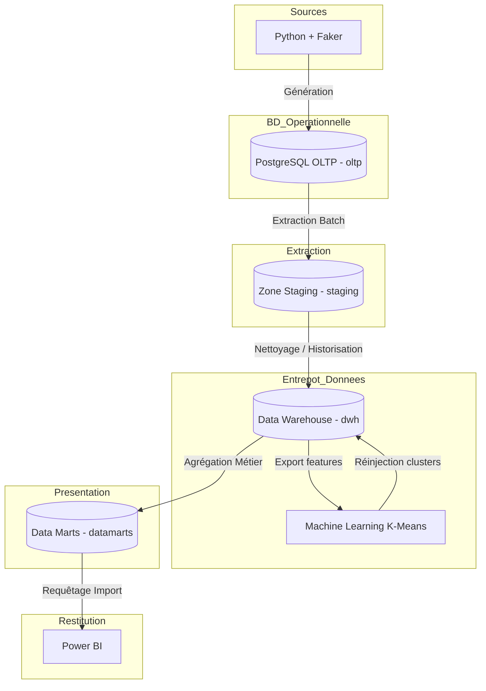

# Spécification de l'Architecture Décisionnelle (DWH)
## Plateforme Décisionnelle Business Banking (Bank of Africa)

---

### 1. Architecture Générale des Flux de Données

Le système d'information décisionnel repose sur une architecture moderne de traitement de données structurée en couches étanches de bout en bout (End-to-End BI) :



#### Rôle de chaque couche :
1.  **Sources Simulées (Python + Faker)** : Script applicatif autonome qui génère et injecte de manière réaliste les entités et flux financiers opérationnels.
2.  **PostgreSQL OLTP (`oltp`)** : Base de données de production normalisée (3NF) assurant l'intégrité transactionnelle.
3.  **STAGING (`staging`)** : Zone tampon hébergeant les tables miroirs de l'OLTP sans contraintes d'intégrité, permettant d'accélérer l'extraction des données sources.
4.  **DATA WAREHOUSE (`dwh`)** : Coeur décisionnel stockant les données nettoyées, dénormalisées sous forme de dimensions historisées et de tables de faits au format **schéma en étoile**.
5.  **DATA MARTS (`datamarts`)** : Couche d'exposition spécialisée sous forme de tables consolidées ou de vues pour des directions métiers (Dépôts, Crédits, Digital, Performance).
6.  **Machine Learning (K-Means)** : Pipeline Python s'exécutant sur les données consolidées du DWH pour regrouper les entreprises clients selon leurs indicateurs comportementaux et financiers, réinjectant ensuite ces labels de segments dans les dimensions.
7.  **Power BI** : Couche finale de restitution interactive, consommant les Data Marts pour le pilotage stratégique et la prise de décision.

---

### 2. Le Schéma en Étoile du Data Warehouse (`dwh`)

Le Data Warehouse est modélisé selon une structure de **Schéma en Étoile** pour simplifier l'écriture des requêtes analytiques (Time Intelligence, agrégations) et maximiser les performances sous Power BI.

```mermaid
erDiagram
    dim_entreprise ||--|{ fait_depots : "Filtrer"
    dim_employe ||--|{ fait_depots : "Filtrer"
    dim_agence ||--|{ fait_depots : "Filtrer"
    dim_region ||--|{ fait_depots : "Filtrer"
    dim_temps ||--|{ fait_depots : "Filtrer"
    dim_produit_depot ||--|{ fait_depots : "Filtrer"
    dim_secteur ||--|{ fait_depots : "Filtrer"

    dim_entreprise ||--|{ fait_credits : "Filtrer"
    dim_employe ||--|{ fait_credits : "Filtrer"
    dim_agence ||--|{ fait_credits : "Filtrer"
    dim_region ||--|{ fait_credits : "Filtrer"
    dim_temps ||--|{ fait_credits : "Filtrer"
    dim_produit_credit ||--|{ fait_credits : "Filtrer"
    dim_secteur ||--|{ fait_credits : "Filtrer"

    dim_entreprise ||--|{ fait_transactions : "Filtrer"
    dim_employe ||--|{ fait_transactions : "Filtrer"
    dim_agence ||--|{ fait_transactions : "Filtrer"
    dim_region ||--|{ fait_transactions : "Filtrer"
    dim_temps ||--|{ fait_transactions : "Filtrer"
    dim_produit_depot ||--|{ fait_transactions : "Filtrer"
    dim_secteur ||--|{ fait_transactions : "Filtrer"

    dim_entreprise ||--|{ fait_digital : "Filtrer"
    dim_employe ||--|{ fait_digital : "Filtrer"
    dim_agence ||--|{ fait_digital : "Filtrer"
    dim_region ||--|{ fait_digital : "Filtrer"
    dim_temps ||--|{ fait_digital : "Filtrer"
    dim_solution_digitale ||--|{ fait_digital : "Filtrer"
    dim_secteur ||--|{ fait_digital : "Filtrer"

    dim_entreprise {
        int key_entreprise PK
        varchar ice
        varchar raison_sociale
        varchar forme_juridique
        date date_creation
        varchar ville
        numeric chiffre_affaires
        int nombre_employes
        varchar segment
        int id_cluster_ia
    }
    dim_employe {
        int key_employe PK
        varchar matricule
        varchar nom
        varchar prenom
        varchar role
    }
    dim_agence {
        int key_agence PK
        varchar code_agence
        varchar nom_agence
        varchar adresse
        varchar ville
        date date_ouverture
        varchar statut
    }
    dim_region {
        int key_region PK
        varchar nom_region
    }
    dim_temps {
        int key_temps PK
        date date_exacte
        varchar mois
        varchar trimestre
        int num_trimestre
        varchar libelle_trimestre
        int annee
        varchar annee_trimestre
    }
    dim_produit_depot {
        int key_produit_depot PK
        varchar type_compte
        varchar libelle_produit
    }
    dim_produit_credit {
        int key_produit_credit PK
        varchar code_produit
        varchar nom_produit
        varchar nom_programme
        varchar nom_famille
    }
    dim_secteur {
        int key_secteur PK
        varchar nom_secteur
    }
    dim_solution_digitale {
        int key_solution PK
        varchar nom_solution
        varchar type_canal
    }
```



---

### 3. Spécifications des 9 Dimensions

Les dimensions du Data Warehouse contiennent les attributs textuels et descriptifs servant d'axes de filtrage pour les rapports. Chaque dimension intègre une **clé substitut (Surrogate Key)** artificielle auto-incrémentée pour découpler le DWH des clés primaires opérationnelles (en prévision d'évolutions ou d'historisations de type SCD).

#### 1. `dim_entreprise`
*   **Rôle métier** : Fournir l'ensemble des axes d'analyse des clients professionnels (TPE/PME/GE).
*   **Source OLTP** : `oltp.entreprises`
*   **Clé substitut (PK)** : `key_entreprise` (`INTEGER / SERIAL`)
*   **Attributs principaux** : `ice`, `raison_sociale`, `forme_juridique`, `date_creation`, `ville`, `chiffre_affaires`, `nombre_employes`, `segment`, `id_cluster_ia` (réinjecté par le ML).

#### 2. `dim_employe`
*   **Rôle métier** : Analyser l'activité commerciale portée par les employés des agences (conseillers, directeurs).
*   **Source OLTP** : `oltp.employes`
*   **Clé substitut (PK)** : `key_employe` (`INTEGER / SERIAL`)
*   **Attributs principaux** : `matricule`, `nom`, `prenom`, `role` (Conseiller, Directeur).

#### 3. `dim_agence`
*   **Rôle métier** : Axe d'analyse géographique et organisationnel des 10 points de vente.
*   **Source OLTP** : `oltp.agences`
*   **Clé substitut (PK)** : `key_agence` (`INTEGER / SERIAL`)
*   **Attributs principaux** : `code_agence`, `nom_agence`, `adresse`, `ville`, `date_ouverture`, `statut`.

#### 4. `dim_region`
*   **Rôle métier** : Axe d'analyse macro-territoriale (les 7 directions régionales BOA).
*   **Source OLTP** : `oltp.regions`
*   **Clé substitut (PK)** : `key_region` (`INTEGER / SERIAL`)
*   **Attributs principaux** : `nom_region`.

#### 5. `dim_temps`
*   **Rôle métier** : Base pivot de toutes les analyses temporelles (Time Intelligence) et comparatifs trimestriels.
*   **Source OLTP** : Générée de manière autonome sous PostgreSQL ou Python pour la période 01/01/2022 au 31/12/2024.
*   **Clé substitut (PK)** : `key_temps` (`INTEGER` au format AAAAMMJJ)
*   **Attributs principaux** : `date_exacte`, `mois` (nom du mois), `trimestre` (1, 2, 3, 4), `num_trimestre` (numérique), `libelle_trimestre` ("T1", "T2", "T3", "T4"), `annee`, `annee_trimestre` ("2024-T1").

#### 6. `dim_produit_depot`
*   **Rôle métier** : Classifier la nature des ressources collectées (Courant ou DAT).
*   **Source OLTP** : Table `oltp.comptes` (champs distincts de `type_compte`).
*   **Clé substitut (PK)** : `key_produit_depot` (`INTEGER / SERIAL`)
*   **Attributs principaux** : `type_compte` (COURANT, DAT), `libelle_produit` (ex: "Compte Courant Entreprise", "Dépôt à Terme").

#### 7. `dim_produit_credit`
*   **Rôle métier** : Classifier les financements accordés selon la hiérarchie complète du catalogue BOA.
*   **Source OLTP** : `oltp.produits_credits`, `oltp.programmes_credits` et `oltp.familles_credits`.
*   **Clé substitut (PK)** : `key_produit_credit` (`INTEGER / SERIAL`)
*   **Attributs principaux** : `code_produit`, `nom_produit`, `nom_programme` (ex: Maroc PME), `nom_famille` (ex: Crédits de Trésorerie).

#### 8. `dim_secteur`
*   **Rôle métier** : Classifier les analyses financières et de risques par branche industrielle/commerciale.
*   **Source OLTP** : `oltp.entreprises` (attribut distinct `secteur_activite`).
*   **Clé substitut (PK)** : `key_secteur` (`INTEGER / SERIAL`)
*   **Attributs principaux** : `nom_secteur` (BTP, Commerce, Services, etc.).

#### 9. `dim_solution_digitale`
*   **Rôle métier** : Suivre l'adoption et les connexions par solution applicative.
*   **Source OLTP** : `oltp.solutions_digitales`
*   **Clé substitut (PK)** : `key_solution` (`INTEGER / SERIAL`)
*   **Attributs principaux** : `nom_solution`, `type_canal` (WEB, MOBILE, ASSISTANT).

---

### 4. Spécifications des 4 Tables de Faits

Les tables de faits contiennent les clés étrangères de liaison vers les dimensions et les mesures numériques quantifiables calculées lors de l'ETL.

#### A. Table `fait_depots`
*   **Granularité** : Un enregistrement par compte bancaire et par trimestre calendaire.
*   **Clés de liaison** : `key_entreprise`, `key_employe` (le conseiller gérant), `key_agence`, `key_region`, `key_temps` (représentant la fin du trimestre), `key_produit_depot`, `key_secteur`.
*   **Mesures calculées** :
    *   `encours` : Solde moyen du compte sur le trimestre concerné (NUMERIC).
    *   `montant_depot` : Cumul financier des flux créditeurs enregistrés sur le trimestre (NUMERIC).
    *   `montant_retrait` : Cumul financier des flux débiteurs enregistrés sur le trimestre (NUMERIC).
    *   `solde` : Solde comptable exact à la date de clôture du trimestre (NUMERIC).
    *   `nombre_operations` : Volume cumulé des transactions passées sur le compte au cours du trimestre (INTEGER).

#### B. Table `fait_credits`
*   **Granularité** : Un enregistrement par contrat de crédit et par trimestre calendaire.
*   **Clés de liaison** : `key_entreprise`, `key_employe` (conseiller), `key_agence`, `key_region`, `key_temps` (fin de trimestre), `key_produit_credit`, `key_secteur`.
*   **Mesures calculées** :
    *   `montant_octroye` : Capital initialement débloqué contractuellement (NUMERIC).
    *   `encours` : Capital restant dû à la fin du trimestre concerné (NUMERIC).
    *   `mensualite` : Montant de la traite périodique (NUMERIC).
    *   `taux_interet` : Taux nominal appliqué au contrat (NUMERIC).
    *   `jours_retard` : Nombre maximal de jours d'impayés enregistrés sur le trimestre (INTEGER).
    *   `indicateur_npl` : Booléen / Entier flag (0 = Sain, 1 = Créance douteuse / NPL).

#### C. Table `fait_transactions`
*   **Granularité** : Une ligne par transaction financière opérationnelle (permet une analyse granulaire fine des flux).
*   **Clés de liaison** : `key_entreprise`, `key_employe` (conseiller), `key_agence`, `key_region`, `key_temps` (date exacte de transaction), `key_produit_depot`, `key_secteur`.
*   **Mesures** :
    *   `montant` : Valeur faciale en MAD de la transaction (NUMERIC).
    *   `nombre_transactions` : Valeur fixe = 1 pour faciliter les comptages cumulés sous Power BI (INTEGER).

#### D. Table `fait_digital`
*   **Granularité** : Une ligne par log de connexion d'une entreprise à un service digital donné.
*   **Clés de liaison** : `key_entreprise`, `key_employe` (conseiller), `key_agence`, `key_region`, `key_temps` (date exacte de connexion), `key_solution`, `key_secteur`.
*   **Mesures** :
    *   `nombre_connexions` : Valeur fixe = 1 par ligne (INTEGER).
    *   `nombre_operations` : Nombre de transactions réalisées au cours de la session digitale connectée (INTEGER).
    *   `duree_connexion` : Durée cumulée de la session en secondes (valeur simulée) (INTEGER).

---

### 5. Concept d'Analyses Trimestrielles

Conformément aux directives de reporting, les analyses stratégiques se baseront sur des variations trimestrielles :
*   Les indicateurs de flux (collecte nette, production de crédits, opérations digitales) seront agrégés sur le trimestre en sommant les mesures associées.
*   Les indicateurs de stock (encours de dépôts, encours de crédits, ratios NPL) seront présentés sous forme de snapshots de fin de trimestre.
*   La dimension `dim_temps` fournira la colonne `annee_trimestre` (ex: `2024-T3`) comme axe principal des graphiques d'évolution sous Power BI. Les formules DAX (Time Intelligence) compareront le trimestre en cours au trimestre précédent ($T$ vs $T-1$) ou au même trimestre de l'année précédente ($T$ vs $T$ de l'année $N-1$).

---

### 6. Organisation des Data Marts (`datamarts`)

Les Data Marts, exposés sous forme de tables matérialisées ou de vuesSQL dans le schéma `datamarts`, sont structurés par domaine pour alimenter les pages Power BI :

1.  **`DM_Depots`** : Consolidation des comptes courants, des DAT et de la collecte nette. Permet de piloter la structure des ressources collectées par agence, secteur et segment d'entreprises.
2.  **`DM_Credits`** : Consolidation de la production de financements, des encours et du suivi des dossiers NPL (Non-Performing Loans) adossés à leurs garanties (calcul du ratio de couverture de la garantie / encours).
3.  **`DM_Performance`** : Consolidation des encours de dépôts et crédits par conseiller entreprise, agence et direction régionale. Permet d'établir les classements (palmarès des agences et conseillers) par collecte et production.
4.  **`DM_Digital`** : Consolidation du taux d'adoption digital (DabaPay Pro, BusinessOnline.ma, CreditBusinessOnline, WhatsApp Business, KODI), des logs de connexions et du volume d'opérations exécutées en ligne.

---

### 7. Intégration du Machine Learning (Segmentation IA)

L'apprentissage automatique est intégré de façon transparente dans l'architecture décisionnelle :

```
[dwh.fait_depots] + [dwh.fait_credits] + [dwh.fait_digital]
                        │
                        ▼ (Extraction des features par entreprise)
               Pipeline K-Means Python
                        │
                        ▼ (Calcul des 4 ou 5 clusters IA)
          Réinjection : UPDATE dwh.dim_entreprise
                 (id_cluster_ia)
```

1.  **Extraction des Features** : Le script Python extrait pour chaque entreprise le chiffre d'affaires, le secteur, son encours moyen de dépôts, son encours de crédit, son taux d'adoption digital et son indicateur de risque (jours de retard / statut NPL).
2.  **Clustering K-Means** : L'algorithme de Scikit-Learn regroupe les entreprises en $K$ clusters homogènes (ex. Cluster 0 = "Grandes Entreprises Fort Emprunteur & Digitalisé", Cluster 1 = "TPE Risque Élevé & Faible Dépôt", etc.).
3.  **Réinjection** : L'identifiant de cluster (`id_cluster_ia`) calculé pour chaque entreprise est réinjecté dans la table `dwh.dim_entreprise`.
4.  **Exploitation Power BI** : Les décideurs peuvent croiser instantanément tous les indicateurs financiers de la banque avec les clusters IA de la dimension entreprise pour un ciblage commercial ou une politique de gestion du risque sur mesure.
