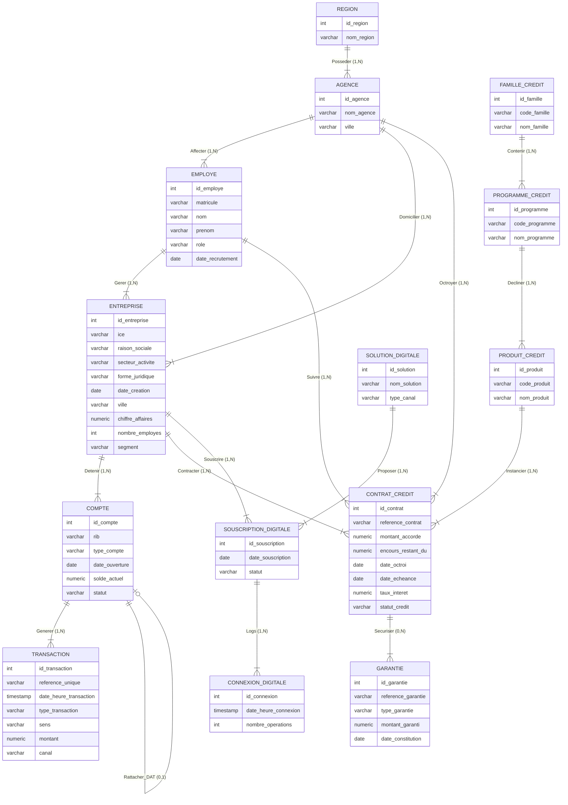

# Modèle Conceptuel de Données (MCD) : Conception Merise
## Plateforme Décisionnelle Business Banking (Bank of Africa)

---

### 1. Introduction & Diagramme Conceptuel (Mermaid)

Le Modèle Conceptuel de Données (MCD) représente la structure de l'information du système d'information de manière sémantique, indépendamment des contraintes techniques de stockage ou de base de données. Il utilise la terminologie Merise avec des **Entités**, des **Associations** (ou relations) et des **Cardinalités**.

---

### 2. Description des Entités & Attributs

#### A. Bloc 1 : Organisation Bancaire
*   **REGION** : Territoire administratif de la banque.
    *   *Attributs* : `id_region` (Identifiant unique), `nom_region` (Nom de la direction régionale).
*   **AGENCE** : Point de vente commercial.
    *   *Attributs* : `id_agence` (Identifiant unique), `nom_agence` (Nom de l'agence), `ville` (Ville d'implantation).
*   **EMPLOYE** : Collaborateur physique exerçant au sein d'une agence.
    *   *Attributs* : `id_employe` (Identifiant unique), `matricule` (Matricule unique RH), `nom`, `prenom`, `role` (Directeur d'agence, Conseiller, Chargé de caisse), `date_recrutement`.

#### B. Bloc 2 : Domaine Dépôts
*   **ENTREPRISE** : Client moral Business Banking de la banque.
    *   *Attributs* : `id_entreprise` (Identifiant unique), `ice` (Identifiant fiscal marocain), `raison_sociale`, `secteur_activite`, `forme_juridique`, `date_creation`, `ville`, `chiffre_affaires`, `nombre_employes`, `segment` (TPE, PME, GE).
*   **COMPTE** : Compte de dépôt (Courant ou DAT).
    *   *Attributs* : `id_compte` (Identifiant unique), `rib` (RIB à 24 chiffres), `type_compte` (Courant, DAT), `date_ouverture`, `solde_actuel`, `statut` (Actif, Inactif).
*   **TRANSACTION** : Écriture comptable passée sur un compte courant.
    *   *Attributs* : `id_transaction` (Identifiant unique), `reference_unique`, `date_heure_transaction`, `type_transaction` (Virement, Versement, Retrait, Prélèvement), `sens` (Débit, Crédit), `montant`, `canal` (Physique, Digital).

#### C. Bloc 3 : Domaine Crédits
*   **FAMILLE_CREDIT** : Macro-catégorie de crédit (ex: Trésorerie, Investissement, Commerce International).
    *   *Attributs* : `id_famille` (Identifiant unique), `code_famille` (TRESORERIE, INVEST, COMMERCE_INT), `nom_famille`.
*   **PROGRAMME_CREDIT** : Sous-ensemble de crédit à but ciblé (ex: Maroc PME, Crédits à Moyen Terme, TAMWILCOM).
    *   *Attributs* : `id_programme` (Identifiant unique), `code_programme`, `nom_programme`.
*   **PRODUIT_CREDIT** : Produit commercial distribuable (ex: Crédit Spot, CAP Energie, Crédit documentaire Import).
    *   *Attributs* : `id_produit` (Identifiant unique), `code_produit`, `nom_produit`.
*   **CONTRAT_CREDIT** : Contrat de prêt unitaire signé avec une entreprise.
    *   *Attributs* : `id_contrat` (Identifiant unique), `reference_contrat`, `montant_accorde`, `encours_restant_du`, `date_octroi`, `date_echeance`, `taux_interet`, `statut_credit` (Actif, Remboursé, NPL).
*   **GARANTIE** : Sûreté liée à un contrat de crédit.
    *   *Attributs* : `id_garantie` (Identifiant unique), `reference_garantie`, `type_garantie` (Aval, Caution, Garantie bancaire), `montant_garanti`, `date_constitution`.

#### D. Bloc 4 : Domaine Digital
*   **SOLUTION_DIGITALE** : Produit digital proposé par la banque (ex: BusinessOnline.ma).
    *   *Attributs* : `id_solution` (Identifiant unique), `nom_solution`, `type_canal`.
*   **SOUSCRIPTION_DIGITALE** : Entité associative d'adhésion d'une entreprise à un produit digital.
    *   *Attributs* : `id_souscription` (Identifiant unique), `date_souscription`, `statut` (Actif, Résilié).
*   **CONNEXION_DIGITALE** : Session d'utilisation des canaux digitaux par l'entreprise souscriptrice.
    *   *Attributs* : `id_connexion` (Identifiant unique), `date_heure_connexion`, `nombre_operations`.

---

### 3. Les Associations, Cardinalités & Justifications

Toutes les associations du modèle sont nommées de manière verbale et portent des cardinalités explicites traduisant les contraintes métier :

#### A. Bloc Organisation
*   **Posséder (REGION $\leftrightarrow$ AGENCE)**
    *   `REGION (1,N) - Posseder - (1,1) AGENCE`
    *   *Justification* : Une région regroupe une ou plusieurs agences (1,N). Une agence appartient obligatoirement à une seule région (1,1).
*   **Affecter (AGENCE $\leftrightarrow$ EMPLOYE)**
    *   `AGENCE (1,N) - Affecter - (1,1) EMPLOYE`
    *   *Justification* : Une agence emploie plusieurs collaborateurs (1,N). Un employé est nécessairement affecté à une seule et unique agence (1,1).

#### B. Bloc Dépôts
*   **Domicilier (AGENCE $\leftrightarrow$ ENTREPRISE)**
    *   `AGENCE (0,N) - Domicilier - (1,1) ENTREPRISE`
    *   *Justification* : Une agence gère la domiciliation de zéro à plusieurs entreprises (0,N). Une entreprise a ses comptes domiciliés dans une seule agence (1,1).
*   **Gérer (EMPLOYE $\leftrightarrow$ ENTREPRISE)**
    *   `EMPLOYE (0,N) - Gerer - (1,1) ENTREPRISE`
    *   *Justification* : Un conseiller entreprise gère un portefeuille composé de plusieurs entreprises (0,N). Une entreprise possède un et un seul conseiller désigné (1,1).
*   **Détenir (ENTREPRISE $\leftrightarrow$ COMPTE)**
    *   `ENTREPRISE (1,N) - Detenir - (1,1) COMPTE`
    *   *Justification* : Une entreprise détient au moins un compte courant et peut en posséder plusieurs (1,N). Un compte appartient obligatoirement à une seule entreprise (1,1).
*   **Générer (COMPTE $\leftrightarrow$ TRANSACTION)**
    *   `COMPTE (0,N) - Generer - (1,1) TRANSACTION`
    *   *Justification* : Un compte courant peut ne pas avoir de transactions au début ou en avoir un grand nombre (0,N). Une transaction affecte nécessairement un seul et unique compte (1,1).
*   **Rattacher_DAT (COMPTE $\leftrightarrow$ COMPTE)**
    *   `COMPTE (DAT) (1,1) - Rattacher_DAT - (0,N) COMPTE (Courant)`
    *   *Justification* : Un compte de type DAT est obligatoirement lié à un compte courant de support (1,1). Un compte courant peut être le support de zéro à plusieurs DAT (0,N).

#### C. Bloc Crédits
*   **Contenir (FAMILLE_CREDIT $\leftrightarrow$ PROGRAMME_CREDIT)**
    *   `FAMILLE_CREDIT (1,N) - Contenir - (1,1) PROGRAMME_CREDIT`
    *   *Justification* : Une famille de crédit regroupe un ou plusieurs programmes (1,N). Un programme de crédit appartient à une seule famille (1,1).
*   **Décliner (PROGRAMME_CREDIT $\leftrightarrow$ PRODUIT_CREDIT)**
    *   `PROGRAMME_CREDIT (1,N) - Decliner - (1,1) PRODUIT_CREDIT`
    *   *Justification* : Un programme de crédit comprend un ou plusieurs produits (1,N). Un produit est une déclinaison d'un unique programme (1,1).
*   **Instancier (PRODUIT_CREDIT $\leftrightarrow$ CONTRAT_CREDIT)**
    *   `PRODUIT_CREDIT (0,N) - Instancier - (1,1) CONTRAT_CREDIT`
    *   *Justification* : Un produit du catalogue peut ne pas avoir été vendu ou l'être plusieurs fois (0,N). Un contrat de prêt fait référence à un seul produit (1,1).
*   **Contracter (ENTREPRISE $\leftrightarrow$ CONTRAT_CREDIT)**
    *   `ENTREPRISE (0,N) - Contracter - (1,1) CONTRAT_CREDIT`
    *   *Justification* : Une entreprise peut n'avoir aucun crédit actif ou en avoir plusieurs (0,N). Un contrat de crédit est attribué à une seule entreprise (1,1).
*   **Suivre (EMPLOYE $\leftrightarrow$ CONTRAT_CREDIT)**
    *   `EMPLOYE (0,N) - Suivre - (1,1) CONTRAT_CREDIT`
    *   *Justification* : Un conseiller suit de zéro à plusieurs contrats de son portefeuille (0,N). Par héritage de l'entreprise, un contrat est obligatoirement suivi par le conseiller de l'entreprise (1,1).
*   **Octroyer (AGENCE $\leftrightarrow$ CONTRAT_CREDIT)**
    *   `AGENCE (0,N) - Octroyer - (1,1) CONTRAT_CREDIT`
    *   *Justification* : Une agence comptabilise de zéro à plusieurs contrats octroyés (0,N). Par héritage, un contrat est rattaché à l'agence de l'entreprise (1,1).
*   **Sécuriser (CONTRAT_CREDIT $\leftrightarrow$ GARANTIE)**
    *   `CONTRAT_CREDIT (0,N) - Securiser - (1,1) GARANTIE`
    *   *Justification* : Un contrat de crédit peut être octroyé sans garantie (ex: crédit spot) ou être adossé à plusieurs cautions (0,N). Une garantie est constituée pour couvrir un et un seul contrat de crédit (1,1).

#### D. Bloc Digital
*   **Souscrire / Proposer (ENTREPRISE $\leftrightarrow$ SOLUTION_DIGITALE via SOUSCRIPTION_DIGITALE)**
    *   `ENTREPRISE (0,N) - Souscrire - (1,1) SOUSCRIPTION_DIGITALE`
    *   `SOLUTION_DIGITALE (0,N) - Proposer - (1,1) SOUSCRIPTION_DIGITALE`
    *   *Justification* : Cette relation de N à N est transformée en une **entité associative** (porteuse d'attributs) pour éliminer les ambiguïtés. Une entreprise peut souscrire à plusieurs solutions via des contrats de souscription distincts. Une solution digitale est proposée à plusieurs entreprises.
*   **Logs (SOUSCRIPTION_DIGITALE $\leftrightarrow$ CONNEXION_DIGITALE)**
    *   `SOUSCRIPTION_DIGITALE (0,N) - Logs - (1,1) CONNEXION_DIGITALE`
    *   *Justification* : Une souscription active enregistre l'historique des connexions (0,N). Chaque log de connexion fait référence à une unique souscription d'entreprise (1,1).

---

### 4. Entités Associatives Porteuses d'Attributs

En méthodologie Merise, certaines relations portent elles-mêmes des attributs. Elles sont représentées ainsi :

*   **SOUSCRIPTION_DIGITALE** : Représente l'association porteuse d'attributs entre `ENTREPRISE` et `SOLUTION_DIGITALE`.
    *   *Attributs portés* :
        *   `Date_Souscription` : Date d'effet de l'adhésion au service.
        *   `Statut` : État de la souscription ('ACTIF', 'RESILIE').
*   **GARANTIE** : Bien que rattachée directement à `CONTRAT_CREDIT` pour couvrir son engagement, elle porte les caractéristiques propres à la sûreté.
    *   *Attributs portés* :
        *   `Type_Garantie` : Aval, Caution administrative, Caution financière, Garantie bancaire.
        *   `Valeur_Garantie` : Montant estimé ou garanti de la sûreté.
        *   `Date_Estimation` (ou `Date_Constitution`) : Date de prise d'effet.

---

### 5. Règles d'Intégrité Conceptuelles (RIC)

Le MCD valide les règles de cohérence conceptuelle et d'intégrité référentielle suivantes :
1.  **Héritage Commercial** : Toute entreprise est affectée à un unique conseiller et une unique agence. Les entités de dépôts (`COMPTES`), crédits (`CONTRATS_CREDITS`) et de digitalisation (`SOUSCRIPTIONS_DIGITALES`) de l'entreprise héritent sémantiquement de ce rattachement.
2.  **Règle d'affectation unique** : Un conseiller ne peut gérer que des entreprises domiciliées dans son agence d'affectation.
3.  **Filiation des comptes de placement** : Un compte DAT ne peut être créé qu'en liaison directe avec un compte courant valide appartenant à la même entreprise.
4.  **Dépendance des écritures** : Une transaction ne peut exister sans être liée à un compte courant actif.
5.  **Exclusivité des garanties** : Une garantie n'a pas d'existence propre autonome. Elle est obligatoirement créée pour sécuriser un contrat de crédit identifié.
6.  **Dépendance des connexions** : Une connexion digitale ne peut être enregistrée que si elle est associée à un contrat de souscription actif pour la solution concernée.

---

### 6. Préparation à la Transformation en Modèle Logique (MLD)

Pour faciliter le passage au MLD Relationnel :
*   Les relations de type `1,N` se traduiront par la migration de la clé primaire de l'entité côté `1` vers l'entité côté `N` sous forme de clé étrangère (ex: `id_agence` migrera dans `EMPLOYES` et `ENTREPRISES`).
*   L'entité associative `SOUSCRIPTION_DIGITALE` se transformera en une table pivot physique contenant sa propre PK (`id_souscription`) et deux clés étrangères (`id_entreprise` et `id_solution`), évitant ainsi la relation N à N directe entre `ENTREPRISE` et `SOLUTION_DIGITALE`.
